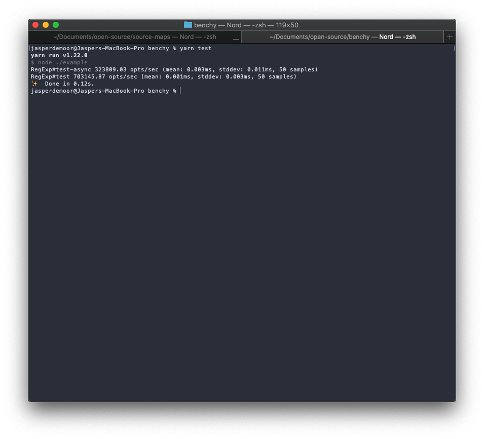

# Benchy

A tiny benchmarking utility that helps run benchmarks quickly.

Supports callback functions which return a promise.

## Usage

```js
const Benchmark = require("tiny-benchy");
const suite = new Benchmark();

suite.add("RegExp#test-async", async () => {
  /o/.test("Hello World!");
});

suite.add("RegExp#test", () => {
  /o/.test("Hello World!");
});

suite.run();
```

## Output


